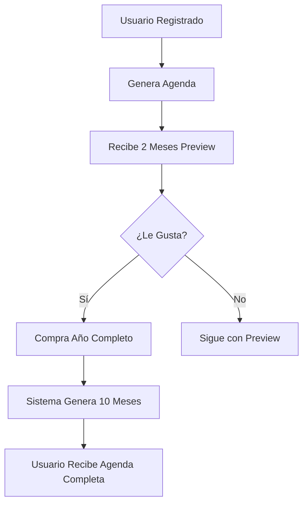

# 💰 Estrategia Preview Gratuito + Pago

## 🎯 Modelo de Monetización

### Preview Gratuito (2 meses)
- **Interpretaciones AI completas** para eventos de los primeros 2 meses
- Usuario experimenta el valor real del producto
- Coste estimado: ~$1-2 (solo eventos de 2 meses con AI)

### Post-Pago (10 meses restantes)
- Se generan **interpretaciones AI completas** para todo el año
- Coste estimado: ~$5-8 (todos los eventos del año con AI)
- Usuario ya vio la calidad, conversión más alta

## 📊 Cálculo de Eventos por Periodo

### 2 Meses (Preview):
- ~4 fases lunares
- ~1 eclipse (promedio)
- ~2-3 retrógrados en curso
- ~8-10 ingresos importantes
- **Total: ~15-20 eventos con AI**

### 10 Meses (Post-Pago):
- ~20 fases lunares
- ~3 eclipses
- ~8-10 retrógrados
- ~40 ingresos
- **Total: ~70-80 eventos con AI**

## 🔧 Implementación Técnica

### 1. Detección de Estado de Pago
```typescript
interface AgendaStatus {
  hasPaid: boolean;
  previewMonths: number; // 2 por defecto
  availableMonths: number; // 2 si no pagó, 12 si pagó
}
```

### 2. Filtrado de Eventos
```typescript
function getAvailableEvents(
  allEvents: Event[],
  birthDate: Date,
  status: AgendaStatus
): Event[] {
  if (status.hasPaid) {
    return allEvents; // Todos los eventos
  }

  // Solo eventos de los primeros N meses
  const cutoffDate = addMonths(birthDate, status.previewMonths);
  return allEvents.filter(e => e.date <= cutoffDate);
}
```

### 3. Generación de Interpretaciones
```typescript
function generateInterpretations(
  events: Event[],
  userProfile: UserProfile,
  status: AgendaStatus
) {
  const availableEvents = getAvailableEvents(events, userProfile.birthDate, status);

  if (status.hasPaid) {
    // Generar AI para TODOS los eventos
    return generateBatchInterpretations(availableEvents, userProfile);
  } else {
    // Generar AI solo para eventos de preview
    return generateBatchInterpretations(availableEvents, userProfile, {
      maxAIInterpretations: 20, // Limitar cantidad de eventos AI
      priorityTypes: ['lunar_phase', 'eclipse'] // Priorizar los más importantes
    });
  }
}
```

## 💡 UX - Mensajes al Usuario

### Vista de Agenda (No Pagada)
```
📅 TIENES ACCESO A: Febrero - Marzo 2025
🔒 DESBLOQUEA: Abril 2025 - Enero 2026

[Botón: Obtener Año Completo - 29€]
```

### Evento Bloqueado
```
🔒 Este evento está disponible en la versión completa

Luna Llena en Leo - 15 de Junio 2025
Esta poderosa Luna Llena activará...

[Ver Interpretación Completa - Desbloquear Agenda]
```

## 📈 Estrategia de Conversión

1. **Onboarding**: Usuario completa datos → recibe 2 meses gratis
2. **Engagement**: Usuario ve interpretaciones AI de calidad
3. **Teaser**: Al llegar a mes 3, muestra preview de eventos bloqueados
4. **CTA**: "Desbloquea tu año completo por 29€"
5. **Post-Compra**: Se generan interpretaciones AI de todos los eventos restantes

## 🎁 Variantes de Preview

### Opción A: 2 meses completos (recomendado)
- Más valor mostrado
- Mayor probabilidad de conversión
- Coste: ~$1-2

### Opción B: 1 mes completo
- Menor inversión inicial
- Menos tiempo para enganchar
- Coste: ~$0.50-1

### Opción C: 3 meses completos
- Máximo valor mostrado
- Riesgo: usuario satisfecho con solo eso
- Coste: ~$2-3

## 🔄 Flujo de Pago



## 📝 Base de Datos

### Modelo AgendaPurchase
```typescript
{
  userId: string;
  purchaseDate: Date;
  amount: number; // 29€
  stripeSessionId: string;
  agendaYear: number; // 2025
  status: 'preview' | 'paid' | 'expired';
  previewMonthsAvailable: number; // 2
  fullYearUnlocked: boolean;
}
```

## 🚀 Próximos Pasos

1. ✅ Crear servicio de interpretaciones (HECHO)
2. ⏳ Integrar lógica de preview/pago en generate-agenda-ai
3. ⏳ Crear modelo MongoDB AgendaPurchase
4. ⏳ Implementar endpoint de verificación de estado
5. ⏳ Modificar frontend para mostrar eventos bloqueados
6. ⏳ Integrar Stripe para compra de año completo
7. ⏳ Implementar generación post-pago de eventos restantes

---

**Coste Estimado Total:**
- Preview: $1-2 por usuario
- Post-Pago: $5-8 por usuario que compra
- **Total usuario que paga: $6-10 (margen de ~20€)**
